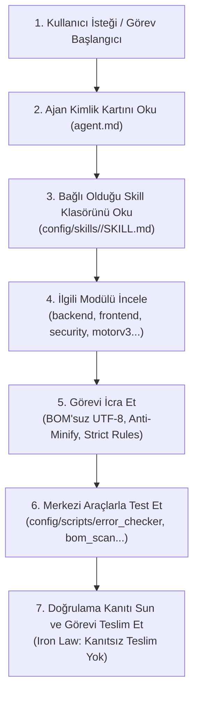

# 👥 ANTIGRAVITY AJANLARI — ÇALIŞMA ŞEKLİ VE SKILL EŞLEŞTİRME KILAVUZU

> **Konum:** `config/agents/`  
> **Bilgi Deposu (Skills):** `config/skills/`  
> **Merkezi Araç Üssü:** `config/scripts/`  
> **Son Güncelleme:** 2026-09-11  
> **Temel İlke:** Her ajan bir kimlik kartıdır (`agent.md`), tüm bilgi birikimini ve operasyon kurallarını `config/skills/` altındaki ilgili beceri klasöründen alır.

---

## 🎯 AJANLARIN ÇALIŞMA ŞEKLİ (SKILL KLASÖRÜNE GÖRE İŞLEYİŞ MİMARİSİ)

Antigravity sisteminde hiçbir ajan "boşta veya kural tanımaz" çalışmaz. Bir ajana görev verildiğinde çalışma protokolü şu deterministik adımları izler:



---

## 🗺️ AJAN ↔ SKILL TAM ÇALIŞMA HARİTASI

| # | Ajan | Bağlı Olduğu Skill Klasörü | İncelenecek Skill Dosyası | Birincil Çalıştıracağı Araç |
|---|---|---|---|---|
| 1 | **php-developer** | `config/skills/ag-php-developer` | `SKILL.md` + Tüm Modüller | `error_checker.js`, `php -l` |
| 2 | **frontend-developer** | `config/skills/ag-php-developer` | `frontend-developer.md` | `dom_utf8_full_test.js` |
| 3 | **backend-developer** | `config/skills/ag-php-developer` | `backend-developer.md` + `database.md` | `error_checker.js`, `php -l` |
| 4 | **php-security-expert** | `config/skills/ag-php-developer` | `php-security.md` | `error_checker.js --strict` |
| 5 | **database-expert** | `config/skills/ag-database-expert` | `SKILL.md` + `ag-php-developer/database.md` | `mysql`, `psql`, `redis-cli` (Homebrew / DBngin) |
| 6 | **seo-expert** | `config/skills/ag-seo-expert` | `motorv3.md`, `seotest.md`, `SKILL.md` | `audit_engine_v3.js`, `sitemap_robots_check.js` |
| 7 | **schema-expert** | `config/skills/ag-schema-expert` | `SKILL.md` | `schema_validator.js` |
| 8 | **seo-structure-tester** | `config/skills/ag-seo-structure-tester` | `SKILL.md` | `heading_semantics_check.js` |
| 9 | **bug-hunter** | `config/skills/ag-bug-hunter` | `SKILL.md` | `error_checker.js`, `bom_utf8_scan.js` |
| 10 | **test-engineer** | `config/skills/ag-test-engineer` | `SKILL.md` (Iron Law) | `with_server.py`, `error_checker.js` |
| 11 | **content-writer** | `config/skills/ag-content-writer` | `SKILL.md` | `seo-checker.js` |
| 12 | **technical-writer** | `config/skills/ag-technical-writer` | `SKILL.md` | `bom_utf8_scan.js` |
| 13 | **devops-engineer** | `config/skills/ag-devops-engineer` | `SKILL.md` | Apache/Nginx, SSL, `zsh/bash` |
| 14 | **project-manager** | `config/skills/ag-project-manager` | `SKILL.md` | 4/4 Kalite Kapısı denetimi |
| 15 | **accessibility-expert** | `config/skills/ag-accessibility-expert` | `SKILL.md` | `heading_semantics_check.js` |
| 16 | **html-export-expert** | `config/skills/ag-html-export-expert` | `SKILL.md` | `dom_utf8_full_test.js` |
| 17 | **mobile-optimization-expert** | `config/skills/ag-mobile-optimization-expert` | `SKILL.md` | `web_vitals_hints.js` |

---

## 🏛️ TEMEL MİMARİ KARAR: `ag-php-developer` ŞEMSİYESİ

Tüm PHP ve modern web geliştirme süreçleri tek bir çatı altında modüler olarak toplanmıştır:
```
config/skills/ag-php-developer/
├── SKILL.md                 → Çekirdek PHP standartları (strict types, mini-MVC)
├── backend-developer.md     → REST API, servis katmanı, N+1 engelleme
├── frontend-developer.md    → Tailwind CSS v4, Alpine.js, semantic HTML, responsive UI
├── php-security.md          → OWASP Top 10, XSS, CSRF, SQLi ve IDOR önleme
├── database.md              → 3NF şema, indeksleme, PDO ve transaction yönetimi
└── frameworks.md            → Laravel, Symfony, CI4, Yii2, Slim4 entegrasyonu
```

---

## ⚙️ MERKEZİ ARAÇ KULLANIM ZORUNLULUĞU

Tüm ajanlar kullanıcı talimatı gereği araçlarını şu merkezi dizinden yürütür:
```bash
# Hata ve Sözdizim Doğrulama (Bug Hunter & QA):
& 'C:Program Files
odejs
node $HOME/.gemini/config/plugins/gemini-master-suite/scripts/error_checker.js <hedef>

# BOM Tarama ve Onarım:
& 'C:Program Files
odejs
node $HOME/.gemini/config/plugins/gemini-master-suite/scripts/bom_utf8_scan.js --fix <yol>\n
# 18 Motorlu Engine V3.0 SEO Denetimi:
& 'C:Program Files
odejs
node $HOME/.gemini/config/plugins/gemini-master-suite/scripts/audit_engine_v3.js <url>
```

---
*Bu kılavuz, tüm ajanların skill klasörüne bağlı deterministik çalışma standardını belirler.*
