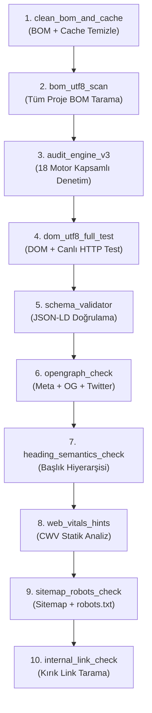

# 🔍 SÜPER SEO MOTORU — ARAÇ SETİ REFERANS KILAVUZU

> **Hedef:** Bu belge; yapay zeka ajanlarının, LLM'lerin ve insan geliştiricilerin `super-seo-motor/araclar` klasöründeki her aracın **ne yaptığını**, **nasıl çalıştığını**, **hangi SEO/AI arama motoru kuralını** uyguladığını ve **hangi sırayla çalıştırılması gerektiğini** tam olarak anlamasını sağlamak için yazılmıştır.

---

## 📐 Temel Mimari Prensip

Tüm araçlar şu felsefeyle inşa edilmiştir:

| Prensip | Açıklama |
|---|---|
| **Sıfır Rastgelelik** | Her çıktı deterministiktir. Aynı girdi → aynı çıktı. |
| **Sıfır Harici Bağımlılık** | Yalnızca Node.js / Python standart çekirdeği kullanılır. |
| **Fail-Closed** | Hata olan motor pipeline'ı durdurmaz; `FAIL` kaydı bırakır. |
| **Raporlama Standardı** | Her araç `PASS`, `FAIL`, `WARN`, `INFO` satırları + özet döndürür. |
| **Çift Dil Desteği** | 11 araç hem JavaScript (Node.js) hem Python ile yazılmıştır. |

---

## 🗂️ Araç Haritası — Hızlı Referans

```
araclar/
├── _lib.js / _lib.py              → Ortak kütüphane (tüm araçlar buradan beslenir)
├── audit_engine_v3.js / .py       → 18 Motorlu Engine V3.0 kapsamlı denetim
├── dom_utf8_full_test.js / .py    → DOM + UTF-8 + canlı HTTP uç nokta testi
├── schema_validator.js / .py      → JSON-LD / Rich Results / Google Schema doğrulayıcı
├── opengraph_check.js / .py       → Title + Meta + Open Graph + Twitter Card denetimi
├── heading_semantics_check.js/.py → H1-H6 hiyerarşi + landmark anlamsal yapı denetimi
├── internal_link_check.js / .py   → Sığ tarama: kırık iç link + zayıf çapa metni
├── sitemap_robots_check.js / .py  → robots.txt + sitemap.xml + LLM yüzeyleri denetimi
├── web_vitals_hints.js / .py      → Core Web Vitals statik kaynak analizi
├── bom_utf8_scan.js / .py         → Tüm proje dosyaları BOM/UTF-8 tarama + isteğe onarım
└── clean_bom_and_cache.js / .py   → Sabit projeye özel BOM temizleme + cache boşaltma
```

---

## 1. `_lib` — Ortak Kütüphane (Tüm Araçların Temeli)

### Amaç
Tüm diğer araçların ortak ihtiyaçlarını (HTTP istekleri, HTML okuma, regex yardımcıları, raporlama) tek bir modülden karşılamak. Hiçbir araç doğrudan `fetch`, `fs` veya `http` çağrısı yapmaz; hepsini `_lib` üzerinden alır.

### Çalışma Mantığı

```
[Araç çalışır]
    │
    ├── parseArgs()         → --key=val, --flag, konum argümanları ayrıştırır
    ├── findProjectRoot()   → composer.json / package.json / .git işaretçisiyle kök bulur
    ├── fetchUrl()          → HTTP/HTTPS GET/HEAD, 6 adım yönlendirme takibi, 20s timeout
    ├── loadHtml()          → URL ise fetchUrl; yerel dosya ise fs.readFileSync
    ├── rx.*               → Önceden derlenmiş regex seti (title, metaName, metaProp, vb.)
    ├── extractJsonLd()     → Tüm <script type="application/ld+json"> bloklarını parse eder
    ├── flattenNodes()      → @graph içindeki node'ları düzleştirir
    └── makeReport()        → PASS/FAIL/WARN/INFO kayıt tutan, text/JSON çıktı üreten rapor
```

### Neden Önemli?
AI arama motorları (GPTBot, ClaudeBot, PerplexityBot) bir sayfayı **tek bir HTTP isteğiyle** tarar. `_lib.fetchUrl` bu davranışı simüle eder: standart tarayıcı değil, **makine bot** kimliğiyle ister, yönlendirmeleri takip eder, timeout'a uyar.

---

## 2. `audit_engine_v3` — 18 Motorlu Engine V3.0 Kapsamlı Denetim

### SEO Bağlamı
Google Alexandria, Perplexity, ChatGPT Search gibi AI arama motorları sayfaları **18 farklı metriğe** göre değerlendirir. Bu araç o 18 motoru **tek geçişte** kontrol eder.

### Çalışma Mantığı

```
HTML (dosya veya URL)
    │
    ├── ENG-01 & ENG-02  → HTML bayt boyutu ölçülür. Kural: ≤ 14.336 byte (14KB TCP Window)
    │                      AI tarayıcılar ilk TCP paketinde 14KB göremezse içeriği demote eder.
    │
    ├── ENG-04           → Title, Meta Description, Canonical, H1 sayısı kontrol edilir.
    │                      Kural: Tam 1 H1, eksiksiz canonical, 55-65 karakter title.
    │
    ├── ENG-10           → H2 ve H3 başlık sayısı sayılır.
    │                      Kural: ColBERT MaxSim için her 1000 kelimede ≥3 başlık.
    │
    ├── ENG-07           → <link rel="describedby" href="/llms.txt"> ve
    │                      <link rel="alternate" type="text/markdown"> varlığı kontrol edilir.
    │                      Kural: AI ajanlar bu bağlantılarla makine yüzeylerini keşfeder.
    │
    ├── ENG-03           → C2PA manifest meta ve dcterms.issued varlığı kontrol edilir.
    │                      Kural: İçerik provenance (köken kanıtı) için kriptografik imza.
    │
    ├── ENG-09           → data-chunk-id özniteliği sayılır.
    │                      Kural: RAG sistemleri 512 token'lık parçalara bölerken sınır kaymaz.
    │
    ├── ENG-06           → hero-answer CSS sınıfı aranır.
    │                      Kural: İlk 100px içinde 29-80 kelimelik atomik cevap bloku.
    │
    └── ENG-08 & ENG-15  → JSON-LD blokları parse edilir. Wikidata QID ve Google MID aranır.
                           Kural: Varlıklar Knowledge Vault'a bağlanmazsa "uydurma" sayılır.
```

### Çıktı Örneği
```
[ENG-04] H1 Sayısı: 1
[ENG-10] ColBERT MaxSim Başlık Sayıları: H2 = 8 , H3 = 12
[ENG-15] Knowledge Vault Wikidata QID: BAĞLI
```

---

## 3. `dom_utf8_full_test` — DOM + UTF-8 + Canlı HTTP Uç Nokta Testi

### SEO Bağlamı
UTF-8 BOM karakteri (`\xEF\xBB\xBF`) HTML başına eklendiğinde bazı AI tarayıcılar sayfayı **ikili veri** olarak sınıflandırır ve indekslemez. Bu araç hem dosya düzeyinde hem de canlı HTTP yanıtında bu riski test eder.

### Çalışma Mantığı

```
AŞAMA 1 — Dosya Düzeyinde BOM Tespiti
    ├── Her PHP/HTML dosyasının ilk 3 byte'ı (0xEF 0xBB 0xBF) kontrol edilir
    └── BOM varsa ❌ FAIL, yoksa ✅ PASS

AŞAMA 2 — Canlı HTTP Charset Kontrolü
    ├── curl veya urllib ile HTTP/1.1 başlıkları çekilir
    ├── Content-Type: charset=utf-8 başlığı aranır
    └── DOM içinde <meta charset="UTF-8"> aranır

AŞAMA 3 — DOM Başlık Hiyerarşisi (ENG-04, ENG-10)
    ├── H1 sayısı (tam 1 olmalı)
    └── H2 + H3 sayısı (ColBERT MaxSim için)

AŞAMA 4 — AEO Hero Answer + RAG Chunk (ENG-06, ENG-09)
    ├── class="hero-answer" varlığı
    └── data-chunk-id sayısı

AŞAMA 5 — LLMO Makine Yüzeyleri (ENG-07, ENG-13)
    ├── <link rel="describedby" href="/llms.txt">
    ├── Canlı /llms.txt → 200 OK ve içerik kontrolü
    ├── /.well-known/agent-card.json → @type: AgentCard kontrolü
    ├── /sitemap.xml → <urlset> varlığı
    └── /robots.txt → GPTBot kuralı varlığı

AŞAMA 6 — Knowledge Vault + JSON-LD (ENG-08, ENG-15)
    ├── Tüm JSON-LD blokları parse edilir
    └── Wikidata QID (wikidata.org/wiki/Q...) aranır
```

---

## 4. `schema_validator` — JSON-LD / Rich Results Doğrulayıcı

### SEO Bağlamı
Google Rich Results (zengin sonuçlar), schema.org JSON-LD verisi gerektirmektedir. Yanlış yapılandırılmış schema hem Rich Result kaybına hem de **DPO (Direct Preference Optimization) demote**'una yol açar.

### Çalışma Mantığı

```
HTML → extractJsonLd() ile tüm bloklar çıkarılır
    │
    ├── JSON parse hatası var mı? → FAIL
    ├── @context schema.org içeriyor mu? → WARN
    ├── @id değerleri benzersiz mi? → WARN
    ├── Dahili @id referansları çözülüyor mu? → WARN
    │
    ├── TİP BAZINDA ZORUNLU ALAN DENETİMİ:
    │   ├── Organization → name, url (zorunlu) | logo, sameAs (önerilen)
    │   ├── Product → name (zorunlu) | image, description, offers (önerilen)
    │   ├── Offer → price, priceCurrency (zorunlu) | priceValidUntil (önerilen)
    │   ├── Article/BlogPosting → headline (zorunlu) | author, datePublished (önerilen)
    │   ├── FAQPage → mainEntity (zorunlu)
    │   ├── LocalBusiness → name, address (zorunlu)
    │   └── AggregateRating → ratingValue, ratingCount (zorunlu)
    │
    └── POLİTİKA RİSK DENETİMİ:
        ├── sameAs: placeholder/uydurma URL → WARN (Google spam filtresi)
        ├── Offer.price ≤ 0 → FAIL (Google geçersiz Offer sayar)
        ├── priceValidUntil geçmişte → WARN (güncellenmiş fiyat yanıltması)
        └── aggregateRating + ratingCount=0 → FAIL (uydurma derecelendirme riski)
```

### Neden Kritik?
Google'ın **Search Console** uyarısı gelmeden önce bu aracın tespiti, olası **manual action** (manuel ceza) önler.

---

## 5. `opengraph_check` — Title + Meta + OG + Twitter Card Denetimi

### SEO Bağlamı
`<head>` bölümündeki meta etiketleri hem klasik SERP görünümünü hem de sosyal medya önizlemesini (Open Graph) hem de AI asistanların sayfayı nasıl özetlediğini doğrudan etkiler.

### Çalışma Mantığı

```
HTML → <head> içeriği regex ile ayrıştırılır
    │
    ├── TITLE:       Uzunluk 15-65 karakter (kısa/uzun → WARN)
    ├── META DESC:   Uzunluk 70-165 karakter
    ├── CANONICAL:   Varlığı + mutlak URL formatı
    ├── ROBOTS:      noindex var mı? → WARN
    ├── VIEWPORT:    Yoksa → FAIL (mobil uyumsuz)
    │
    ├── OPEN GRAPH (5 zorunlu alan):
    │   ├── og:title, og:type, og:url, og:image, og:description → FAIL yoksa
    │   ├── og:image mutlak URL mu? → WARN
    │   ├── og:site_name → WARN yoksa
    │   └── og:locale (ör. tr_TR) → WARN yoksa
    │
    ├── TWITTER CARD:
    │   ├── twitter:card → FAIL yoksa
    │   └── twitter:title, twitter:description, twitter:image → WARN yoksa
    │
    └── ARTICLE ZAMAN DAMGALARI:
        └── og:type=article ise article:published_time + modified_time → WARN yoksa
```

---

## 6. `heading_semantics_check` — H1-H6 Hiyerarşi + Anlamsal Yapı Denetimi

### SEO Bağlamı
AI dil modelleri bir belgeyi **outline tree** (hiyerarşi ağacı) olarak yorumlar. H1'den H4'e atlayan bir yapı modelin **sınır belirsizliği** algılamasına ve demote'a neden olur.

### Çalışma Mantığı

```
HTML → tüm <h1>-<h6> etiketleri sırayla çekilir
    │
    ├── H1 KONTROLÜ:
    │   ├── 0 adet → FAIL (H1 yok)
    │   ├── 2+ adet → FAIL (çok fazla H1)
    │   └── Tam 1 adet → PASS
    │
    ├── HİYERARŞİ ATLAMA:
    │   ├── H2 → H4 gibi bir seviye atlama → FAIL
    │   └── Düzgün hiyerarşi → PASS
    │
    ├── BOŞ BAŞLIKLAR:
    │   └── İçeriksiz <h2></h2> → WARN
    │
    ├── OUTLINE ÇIKTI (INFO):
    │   └── Tüm başlıklar girintili liste olarak gösterilir
    │
    ├── LANDMARK / ANLAMSEİ ETİKETLER:
    │   ├── <header> → WARN yoksa
    │   ├── <nav> → WARN yoksa
    │   ├── <main> → tam 1 adet olmalı (0 veya 2+ → FAIL)
    │   └── <footer> → WARN yoksa
    │
    ├── DİL ETİKETİ:
    │   └── <html lang="tr"> yoksa → FAIL
    │
    └── GÖRSEL ALT METİN:
        └── alt="" eksik olan  sayısı → WARN
```

---

## 7. `internal_link_check` — Kırık İç Link + Zayıf Çapa Metni Denetimi

### SEO Bağlamı
PageRank akışı iç linkler üzerinden gerçekleşir. Kırık iç link (%404) hem kullanıcı deneyimini hem de tarayıcı bütçesini (crawl budget) tüketir. Jenerik çapa metinleri ("tıklayın", "buraya") ise **ColBERT MaxSim** skorunu düşürür çünkü token matrisi anlamsız vektöre dönüşür.

### Çalışma Mantığı

```
[başlangıç URL]
    │
    ├── Sayfa HTML'i çekilir
    ├── Tüm <a href="..."> etiketleri regex ile bulunur
    │
    ├── Her link için:
    │   ├── mailto:/tel:/javascript:/#  → atla (dahili değil)
    │   ├── Farklı origin → atla (harici link)
    │   ├── Kendi origin'i → HEAD isteği at
    │   │   ├── 0 (erişilemez) → FAIL
    │   │   ├── 4xx/5xx → FAIL
    │   │   └── 3xx → WARN (yönlendirme zinciri)
    │   │
    │   └── Çapa metni kontrolü:
    │       ├── Boş → WARN
    │       └── Jenerik ("tıklayın","here","more",">>") → WARN
    │
    ├── depth < maxDepth ise bulunan linkler sıraya eklenir (BFS tarama)
    └── Özet: kaç sayfa tarandı, kaç benzersiz link kontrol edildi
```

### Parametreler
| Parametre | Varsayılan | Açıklama |
|---|---|---|
| `--max` | 60 | Maksimum sayfa tarama sayısı |
| `--depth` | 1 | Tarama derinliği (1=sadece başlangıç sayfası) |
| `--json` | kapalı | Makine okunabilir JSON çıktısı |

---

## 8. `sitemap_robots_check` — robots.txt + Sitemap + LLM Yüzeyleri Denetimi

### SEO Bağlamı
AI arama motorlarının (`GPTBot`, `PerplexityBot`, `ClaudeBot`) ve `robots.txt` protokolüne uyan tüm tarayıcıların siteye nasıl eriştiği burada belirlenir. Yanlış bir `Disallow: /` sitenin tamamını indeksten silebilir.

### Çalışma Mantığı

```
[origin URL]
    │
    ├── ROBOTS.TXT:
    │   ├── /robots.txt → HTTP 200 + içerik var mı?
    │   ├── Disallow: / → tüm site kapalı mı? → FAIL (kritik!)
    │   └── Sitemap: satırı var mı? → sitemap URL'leri toplanır
    │
    ├── SITEMAP.XML:
    │   ├── Her sitemap URL'si çekilir
    │   ├── <urlset> veya <sitemapindex> XML formatı doğrulanır
    │   ├── Sitemapindex ise alt sitemaplar da ziyaret edilir
    │   ├── Boş <lastmod></lastmod> → WARN (sahte tazelik riski)
    │   └── Toplam URL sayısı raporlanır
    │
    ├── URL ÖRNEKLEME (--max adet):
    │   ├── Sitemaptaki URL'lere GET isteği atılır
    │   ├── 4xx/5xx → FAIL
    │   └── Yönlendirme → WARN
    │
    └── LLM / MAKİNE YÜZEYLERİ:
        ├── /llms.txt → 200 OK + içerik?
        ├── /llms-full.txt → 200 OK?
        ├── /.well-known/agent-card.json → 200 OK? (A2A Agent Protocol)
        └── /.well-known/ai-plugin.json → 200 OK? (OpenAI Plugin uyumluluğu)
```

---

## 9. `web_vitals_hints` — Core Web Vitals Statik Kaynak Analizi

### SEO Bağlamı
Google'ın **Core Web Vitals** (LCP, CLS, INP) puanı doğrudan SERP sıralamasını etkiler. Bu araç gerçek lab testi yapmaz; bunun yerine kaynak kodunu inceleyerek **hangi hatanın neden oluşacağını** önceden tespit eder.

### Çalışma Mantığı

```
HTML kaynağı
    │
    ├── BOYUT ANALİZİ:
    │   ├── Toplam byte > 100KB → WARN (LCP/TTFB riski)
    │   └── İlk 14KB bütçesi → INFO
    │
    ├── RENDER-BLOCKING CSS (LCP etkisi):
    │   ├── <link rel="stylesheet"> sayısı
    │   ├── media=print olanlar hariç tutulur
    │   └── > 2 render-blocking CSS → WARN
    │
    ├── RENDER-BLOCKING JS (INP/LCP etkisi):
    │   ├── <head> içinde async/defer/module olmayan <script src>
    │   └── Varsa → FAIL
    │
    ├── 3. PARTİ SCRİPTLER:
    │   └── Harici domain'den gelen script'ler listelenir → WARN
    │
    ├── GÖRSELLER — CLS riski:
    │   ├── width/height eksik  → WARN (CLS!)
    │   ├── loading=lazy eksik → WARN (LCP delay)
    │   └── .jpg/.png/.gif yerine webp/avif önerilir
    │
    ├── PRECONNECT/DNS-PREFETCH:
    │   └── Harici köken var ama preconnect yok → WARN
    │
    ├── FONT OPTİMİZASYONU:
    │   ├── Google Fonts + gstatic preconnect eksik → WARN
    │   └── @font-face + font-display eksik → WARN (FOIT/FOUT)
    │
    └── HTTP BAŞLIKLARI (URL modunda):
        ├── content-encoding (br/gzip) → kontrol
        └── cache-control → eksikse WARN
```

---

## 10. `bom_utf8_scan` — Tüm Proje BOM/UTF-8 Tarama + Onarım

### SEO Bağlamı
UTF-8 BOM, PHP motoru (özellikle `header()` çağrısından önce) ve bazı XML parser'lar için gizli çıktı üretir. Bu durum `Cannot modify header information` hatasına ve bozuk XML/JSON yanıtlarına yol açar. Bozuk XML sitemap AI tarayıcıları tarafından atlanır.

### Çalışma Mantığı

```
[kök dizin veya otomatik bulma]
    │
    ├── walk() → özyinelemeli dosya gezgini
    │   Atlanır: vendor/, node_modules/, .git/, dist/, build/, storage/
    │
    ├── Her .php/.json/.html/.js/.css/.xml/.txt/.md dosyası için:
    │   ├── İlk 3 byte: 0xEF 0xBB 0xBF?
    │   │   ├── --fix varsa → BOM silindi, dosya yeniden yazıldı → PASS
    │   │   └── --fix yoksa → FAIL (hangi dosya olduğu raporlanır)
    │   │
    │   └── Minify şüphesi:
    │       └── .php/.js/.css > 3000 byte + satır sonu yok → WARN
    │
    ├── --cache=storage/cache → belirtilen dizindeki dosyaları siler
    └── --json → JSON raporu
```

### Parametreler
| Parametre | Açıklama |
|---|---|
| `--fix` | Tespit edilen BOM'ları otomatik siler |
| `--ext=php,html,js` | Taranacak uzantıları özelleştirir |
| `--cache=storage/cache` | Belirtilen cache dizinini boşaltır |
| `--json` | Makine okunabilir çıktı |

---

## 11. `clean_bom_and_cache` — Projeye Özel BOM Temizle + Cache Sıfırla

### Amaç
`bom_utf8_scan`'ın sabit proje yolu için özelleştirilmiş, tek tıkla çalışan versiyonu. Argüman gerektirmez; proje kökü ve cache dizini kod içinde sabit tanımlıdır.

### Çalışma Mantığı

```
$HOME/Sites/satis/ dizinini özyinelemeli tarar
    │
    ├── .php / .json / .html / .js / .css dosyaları
    │   └── BOM (0xEF 0xBB 0xBF) varsa → sil, yeniden yaz
    │
    └── $HOME/Sites/satis/storage/cache/ dizini
        └── Tüm dosyaları sil (PageCache sıfırla)
```

> **Not:** Bu araç destructive (kalıcı yazma) işlem yapar. Sürüm kontrolü (git commit) sonrasında çalıştırın.

---

## 🔄 Önerilen Çalıştırma Sırası (CI/CD Pipeline)



---

## 📊 Rapor Çıktı Formatı (Tüm Araçlar Aynı Formatı Kullanır)

```
# ARAÇ ADI — hedef
- [PASS] TEST_ID — başarılı açıklama
- [FAIL] TEST_ID — başarısız açıklama
- [WARN] TEST_ID — uyarı açıklama
- [INFO] TEST_ID — bilgi notu

SONUÇ: PASS=12  FAIL=2  WARN=5
```

**JSON çıktısı (`--json` flag):**
```json
{
  "summary": { "pass": 12, "fail": 2, "warn": 5, "total": 19 },
  "text": "# ARAÇ ADI ...\n..."
}
```

**Çıkış kodları:**
| Kod | Anlam |
|---|---|
| `0` | Tüm testler PASS — pipeline devam edebilir |
| `1` | En az 1 FAIL — pipeline durdurulmalı |
| `2` | Argüman/dosya hatası |

---

## 🤖 Yapay Zeka Ajanları İçin Çağrı Kılavuzu

Bu araçları bir LLM veya otomasyon ajanı çağırırken aşağıdaki kuralları uygulayın:

1. **Sıralamaya uyun:** `clean_bom_and_cache` → `audit_engine_v3` → `schema_validator` sırası zorunludur. Bağımlılık vardır.
2. **`--json` kullanın:** Makine tarafında işlenecekse her zaman `--json` ekleyin.
3. **Çıkış kodunu kontrol edin:** `exit code 1` = pipeline durdur, düzelt, tekrar çalıştır.
4. **Paralel çalıştırın:** `opengraph_check`, `heading_semantics_check`, `web_vitals_hints` birbirinden bağımsızdır, paralel çalıştırılabilir.
5. **Destructive araçları koruyun:** `clean_bom_and_cache` ve `bom_utf8_scan --fix` kalıcı dosya değişikliği yapar. Git commit sonrası çalıştırın.

---

## 🔗 Engine V3.0 — Araç ↔ Motor Eşleştirmesi

| Engine ID | Motor Adı | İlgili Araç |
|---|---|---|
| ENG-01 | KV-Cache Optimization (14KB) | `audit_engine_v3`, `web_vitals_hints` |
| ENG-02 | Edge TTFB | `web_vitals_hints` |
| ENG-03 | C2PA Provenance | `audit_engine_v3`, `dom_utf8_full_test` |
| ENG-04 | Core SEO (Title/H1/Canonical) | `audit_engine_v3`, `opengraph_check` |
| ENG-05 | GEO (Generative Engine Opt.) | `audit_engine_v3` |
| ENG-06 | AEO Hero Answer | `audit_engine_v3`, `dom_utf8_full_test` |
| ENG-07 | LLMO Makine Yüzeyleri | `audit_engine_v3`, `sitemap_robots_check` |
| ENG-08 | Entity Graph / JSON-LD | `schema_validator`, `audit_engine_v3` |
| ENG-09 | Cross-Encoder RAG Chunks | `audit_engine_v3`, `dom_utf8_full_test` |
| ENG-10 | ColBERT MaxSim Headings | `heading_semantics_check`, `audit_engine_v3` |
| ENG-11 | DPO Alignment | `schema_validator` (placeholder/superlative) |
| ENG-12 | Synthetic Citation | `schema_validator`, `opengraph_check` |
| ENG-13 | AAO / Agent Optimization | `sitemap_robots_check`, `dom_utf8_full_test` |
| ENG-14 | EEAT Scoring | `schema_validator` |
| ENG-15 | Knowledge Vault / Wikidata | `audit_engine_v3`, `schema_validator` |
| ENG-16 | Hallucination Interception | `schema_validator` (politika riskleri) |
| ENG-17 | Dark Pool Remediation | `internal_link_check` |
| ENG-18 | Historical Corpus | `bom_utf8_scan` (dosya bütünlüğü) |

---

*Bu belge super-seo-motor Engine V3.0 araç setinin resmi referansıdır.*
*MANDATE-SUPER-2026-V3 · Sıfır Hata · Deterministik · Bağımlılıksız*
