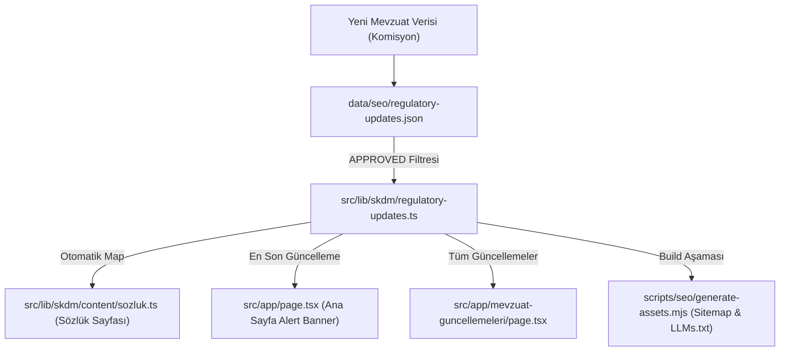

# SKDM Mevzuat ve Operasyonel Güncellemeler Veri Akış Standartı

Bu doküman, **SKDMHesapla** platformunda yayımlanan resmî AB Komisyonu mevzuat güncellemelerinin ve operasyonel duyuruların sisteme nasıl ekleneceğini, hangi dosyalara otomatik olarak yansıtılacağını ve veri tutarlılığının nasıl korunacağını tanımlayan **Tek Kaynaklı Doğruluk (SSOT)** standardıdır.

Bu repoda çalışan tüm AI Kodlama Ajanları (Antigravity, Cursor, ChatGPT vb.) ve geliştiriciler yeni bir güncelleme eklerken veya sistemi güncellerken bu akış mimarisine **istisnasız** uymak zorundadır.

---

## 1. Veri Akış Mimarisi (Mevzuat Güncelleme Döngüsü)



---

## 2. Standart Operasyon Adımları (SOP)

### Adım 1: Güncellemenin JSON Dosyasına Eklenmesi
Tüm yeni güncellemeler yalnızca `data/seo/regulatory-updates.json` dosyasına eklenir. Asla doğrudan sayfa kodlarına (hardcoded) yazılmaz.

**Gerekli JSON Şeması:**
```json
{
  "slug": "cbam-update-slug-2026",
  "publicationState": "APPROVED",
  "humanReviewedAt": "YYYY-MM-DD",
  "detectedAt": "YYYY-MM-DDTHH:MM:SS+03:00",
  "officialPublishedAt": "YYYY-MM-DD",
  "priority": "P0", 
  "sourceType": "OFFICIAL_GUIDANCE", 
  "sourceTypeLabel": "Duyuru Kaynak Başlığı",
  "title": "Güncellemenin Tam Başlığı (Türkçe)",
  "shortTitle": "Güncelleme Kısa Başlığı (Rozetler İçin)",
  "sourceUrl": "https://...",
  "summary": "Güncellemenin detaylı açıklaması ve metodolojik özeti.",
  "exporterImpact": "Türk ihracatçısına doğrudan etkisi.",
  "legalBasis": "Dayanak Tüzük Numarası (örn. (EU) 2025/2083)",
  "affectedModules": ["wizard", "accreditation"],
  "userActions": ["Adım 1: Aksiyon", "Adım 2: Aksiyon"]
}
```
> [!IMPORTANT]
> `publicationState` alanı yalnızca insan incelemesi bittikten sonra `"APPROVED"` yapılarak yayına alınır. `"DRAFT"` durumundaki güncellemeler filtreler tarafından elenir.

---

### Adım 2: Sözlük Entegrasyon Kuralları
`src/lib/skdm/content/sozluk.ts` dosyası, `REGULATORY_UPDATES` listesini import eder ve her güncellemeyi otomatik olarak birer sözlük terimine map'ler.

- **Dinamik Dönüşüm:**
  - `id`: Güncellemenin `slug` değeri ile eşleşir (örn. `/sozluk/#cbam-update-slug-2026`).
  - `kategori`: `"mevzuat"` olarak set edilir.
  - `pubDate` ve `sysDate`: `formatDate` yardımcı fonksiyonu ile Türkçe tarih formatına (örn. `"24 Ağustos 2026"`) dönüştürülerek `SozlukTerim` objesinin ilgili alanlarına atanır.
- **Görsel Rozetler (Badges):**
  `SozlukIndexClient.tsx` bileşeni, eğer terimde `pubDate` ve `sysDate` alanları tanımlıysa, tanım metninin hemen altında açık mavi (Resmî CBAM Yayın Tarihi) ve açık gri (SKDMHesapla Eklenme Tarihi) rozetlerini otomatik olarak çizer.

- **Hydration Güvencesi (Dynamic Import - ssr: false):**
  Tarayıcı önbelleği (CDN cache) kaynaklı eski HTML ile yeni JS bundle uyumsuzluklarını ve React 19 hydration mismatch çökmelerini kalıcı olarak önlemek amacıyla, güncellemeleri listeleyen client bileşenleri (`SozlukIndexClient` ve `RegulatoryIndexClient`) ilgili sayfalarda (`/sozluk/page.tsx` ve `/mevzuat-guncellemeleri/page.tsx`) `next/dynamic` kullanılarak **kesinlikle `{ ssr: false }` ayarıyla** yüklenmelidir.

---

### Adım 3: Ana Sayfa Alert Banner Kuralları
Ana sayfanın (`src/app/page.tsx`) en üstündeki alert banner, `REGULATORY_UPDATES[0]` (en son onaylanan güncelleme) nesnesini dinamik olarak çeker.
- Tarih formatlanır (örn. `24 Ağustos 2026`).
- Banner üzerinde `{latestUpdate.shortTitle} yayımlandı.` metni basılır.
- Link doğrudan `/sozluk/#${latestUpdate.slug}` anchor adresine yönlendirilir.

---

### Adım 4: Build, Sitemap ve LLMs.txt Üretimi
Proje derlenirken (`npm run build`), `scripts/seo/generate-assets.mjs` script'i çalışır:
1. `/mevzuat-guncellemeleri/{slug}/` rotalarını ve markdown dosyalarını otomatik üretir.
2. Bunları `sitemap.xml` ve `sitemap-baseline.json` içine yazar.
3. `llms.txt` dosyasını günceller.

> [!WARNING]
> `generate-assets.mjs` içerisinde `llms.txt` oluşturulurken, `/mevzuat-guncellemeleri/` dizin linkleri asla el ile (hardcoded) push edilmemelidir. Aksi halde `ai-audit.mjs` aşamasında mükerrer (duplicate) URL hatası vererek build'i kıracaktır.

---

## 3. Kod Kalite Garantisi (Quality Gates)
Tüm bu veri akışının bozulmadığını garanti etmek için her deploy öncesinde aşağıdaki kalite kontrol testleri çalıştırılır:
`npm run test:skdm`

Bu testler, tüm adımların (GATE-A'dan GATE-R'ye) ve veri modellerinin tutarlılığını garanti altına alır. Testler geçmeden hiçbir dal (branch) ana dala (`main`) merge edilemez ve canlıya (`deploy:site`) alınamaz.
